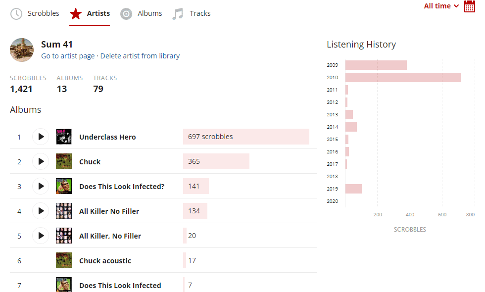
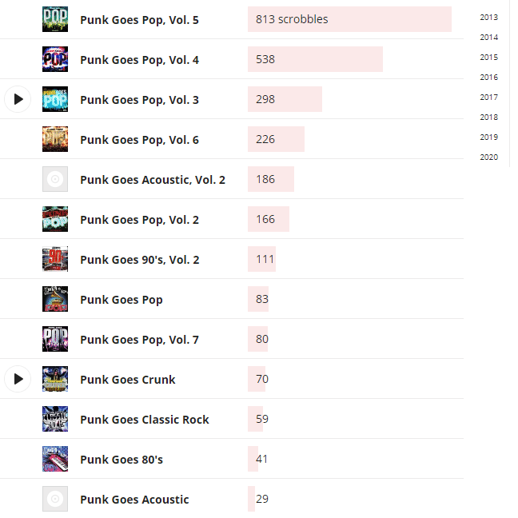
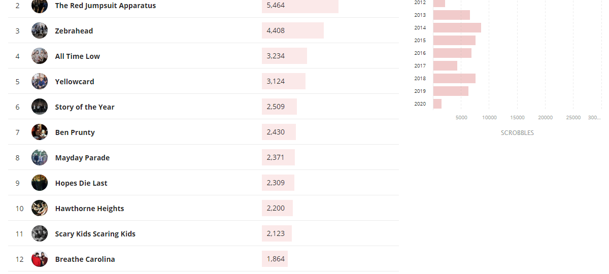
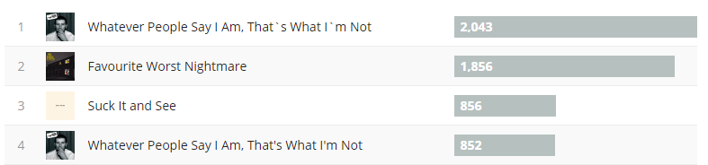
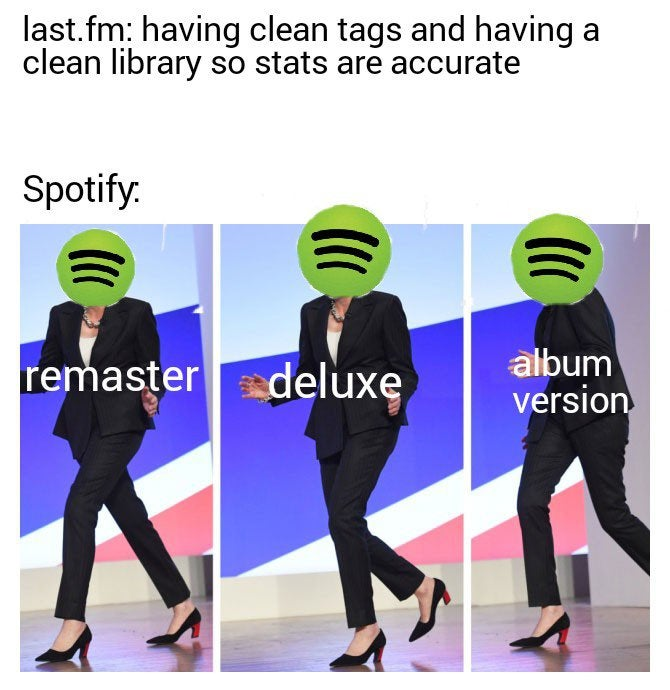
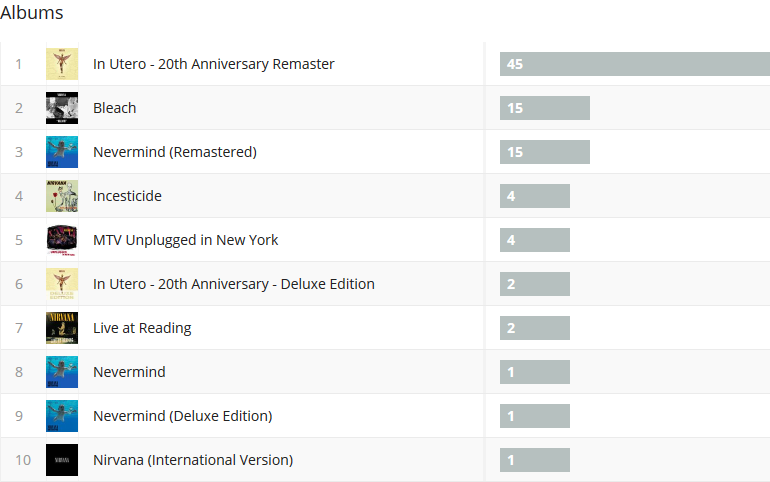
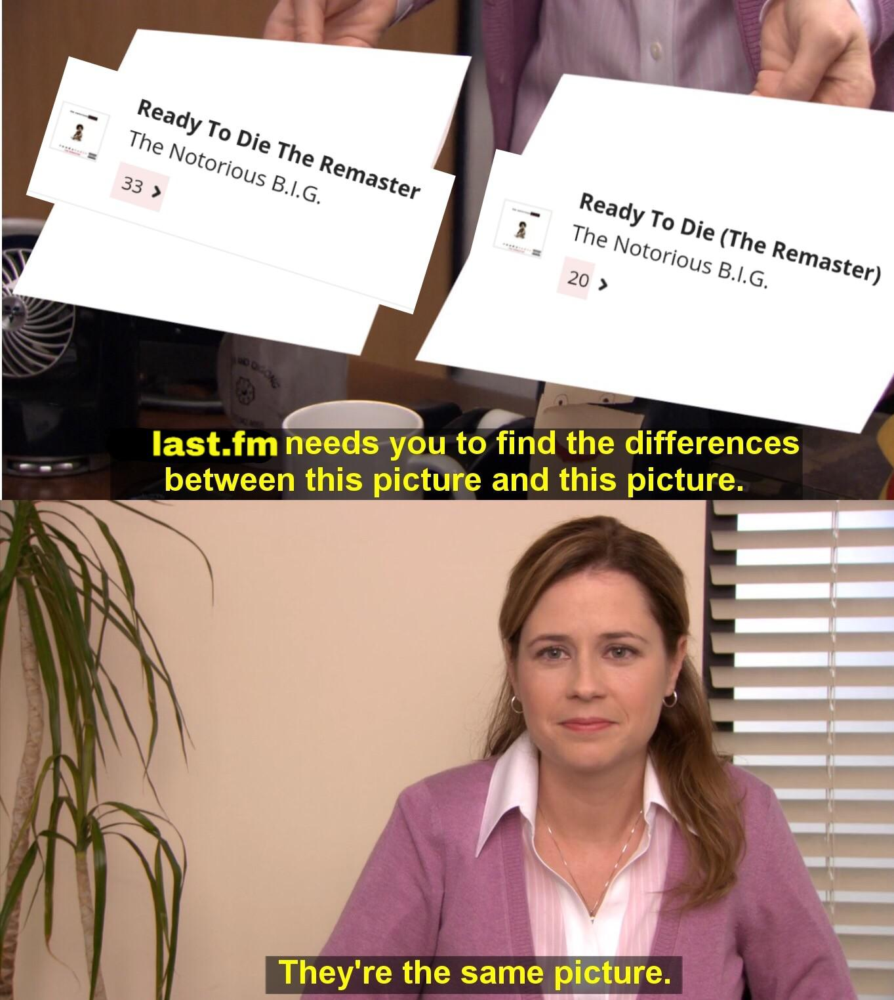

# Last.fm Bulk Edit

Bulk edit your scrobbles for any artist, album or track on [Last.fm](https://www.last.fm/) at once.

## Instructions
1. Upgrade to [Last.fm Pro](https://www.last.fm/pro).
2. Install a userscript manager:
   - [Violentmonkey](https://violentmonkey.github.io/) (recommended).
   - [Tampermonkey](https://tampermonkey.net/) (alternative to Violentmonkey, supports more browsers).
   - Greasemonkey is currently not supported, see FAQ.
3. Install this userscript: [Last.fm Bulk Edit](https://raw.githubusercontent.com/RudeySH/lastfm-bulk-edit/master/lastfm-bulk-edit.user.js).
   - If you're using Violentmonkey, press the "Confirm installation" button on the top-right.
   - If you're using Tampermonkey, press the "Install" or "Reinstall" button on the top-left.
4. Go to your [Last.fm library](https://www.last.fm/user/_/library/artists).
5. Use the new "Edit scrobbles" menu item like in the examples below.

To update the installed userscript to the latest version, simply do step 3 again.

## Examples

### Merging albums, fixing album names, and removing albums

Go to any artist in your library. Click on the dropdown button next to any album, and select "Edit scrobbles". Wait for the dialog to load. Edit the track, artist, album or album artist to your desire, then click "Save edit".

### Select which albums you want to edit when editing compilations

Last.fm Bulk Edit will automatically detect when an album you're editing contains tracks that have been scrobbled on different albums as well. Depending on the track, that may or may not be correct, so you'll be able to select which albums get edited and which don't.

### Replacing an incorrect artist name with Last.fm's auto-corrected name

In this example, auto-corrections are still turned on, but the steps are roughly the same for when auto-corrections are turned off.

This GIF also demonstrates that the album artist name is kept in sync when changing the artist name.

## Frequently asked questions

### Why did my edit not save properly?

There could be many reasons for this. Sometimes Last.fm servers are too busy, try again later. Keep in mind that it is not possible to change just the upper or lower casing of names, [due to how these are stored in Last.fm's database](https://getsatisfaction.com/lastfm/topics/website-update-12-march-editing-scrobbles-subscriber-feature).

### How do I get in contact with you?

If you have found a bug, or want to propose a feature or improvement, feel free to open a [GitHub issue](https://github.com/RudeySH/lastfm-bulk-edit/issues). For general support or discussion, use [GitHub discussions](https://github.com/RudeySH/lastfm-bulk-edit/discussions) or contact me on Discord, you'll find me in the [Last.fm Discord](https://discord.gg/6aTeg3u) (I'm Rudey#5517).

### Why do I need a Last.fm Pro subscription?

[Last.fm Pro](https://www.last.fm/pro) enables subscribers to edit scrobbles, one track at a time[1](#f1). Last.fm Bulk Edit uses this feature behind the scenes to perform bulk editing.

<strong id="f1">1</strong>: Last.fm only lets you bulk edit an exact artist, track, album and album artist combination. See the next paragraph for more information.

### How is this different from Last.fm's bulk edit checkbox?

When you edit a scrobble on Last.fm, you'll see this checkbox:

This checkbox lets you to bulk edit an exact artist, track, album and album artist combination. This often means you can't edit all scrobbles of a given track at once, because it is likely some scrobbles have a different album or album artist.

Last.fm Bulk Edit lets you edit all scrobbles of a given track at once, regardless of differences between scrobbles in artist, album or album artist. Better yet, Last.fm Bulk Edit also lets you edit all scrobbles of an artist or album at once.

### How is this different from the other batch edit userscript?

The other userscript, [lastfm-batch-edit](https://github.com/danielrw7/lastfm-batch-edit), was created before Last.fm added the bulk edit checkbox. That userscript has similar limitations. It can't edit all scrobbles of an artist or album at once.

### What are userscripts?

Userscripts are programs that augment your browsing experience.
For example, they can add features or enhancements to existing websites.
Userscripts are not browser extensions. Instead, they can be enabled by a userscript manager.
Userscript managers are browser extensions that install and run userscripts for you.

[Violentmonkey](https://violentmonkey.github.io/) and [Tampermonkey](https://tampermonkey.net/) are the most popular userscript managers. Last.fm Bulk Edit currently only supports Violentmonkey and Tampermonkey.

### Why is Greasemonkey not supported?

Last.fm Bulk Edit uses the [Fetch API](https://developer.mozilla.org/en-US/docs/Web/API/Fetch_API) to post form data to edit scrobbles. Greasemonkey has some issues with the Fetch API:
- https://github.com/greasemonkey/greasemonkey/issues/2647
- https://github.com/greasemonkey/greasemonkey/issues/3071
- https://github.com/greasemonkey/greasemonkey/issues/3072

### Why did you make this?

Because it is easy to scrobble with bad metadata, but hard to fix it. Editing scrobbles one by one is a pain. Music streaming services like Spotify do not allow you to clean up tags, so there is no way to prevent it from happening in the first place.

Redditors of [r/lastfm](https://www.reddit.com/r/lastfm) have expressed similar frustrations.

[u/willguitar100 posted](https://www.reddit.com/r/lastfm/comments/azks0z/the_most_painful_thing_ive_noticed_in_my_lastfm/):

> The most painful thing I've noticed in my last.fm yet. Apparently I used the wrong apostrophe.

[u/Cyreniac posted](https://www.reddit.com/r/lastfm/comments/ahbr4w/are_memes_allowed_here/):

[u/Bluegorilla101 posted](https://www.reddit.com/r/lastfm/comments/8ver9b/the_struggles_of_using_spotify_to_scrobble/):

> The struggles of using Spotify to scrobble.

[u/tjdeignan posted](https://www.reddit.com/r/lastfm/comments/dagrtb/why/):

### Who are you?

I'm Rudey. Check out [my Last.fm profile](https://www.last.fm/user/RudeySH).

### How do I support Last.fm Bulk Edit?

Star this repository on GitHub and spread the word! Here's a PayPal donate link:

