# Last.fm Advanced (Bulk Edit)

New and improved features for [Last.fm](https://www.last.fm/).
Advanced bulk edit, and more!

## Features

For [Last.fm Pro](https://www.last.fm/pro) users:
- [Advanced bulk edit](#advanced-bulk-edit)
- [Improved automatic edits page](#improved-automatic-edits-page)

For all users:
- [View album names and album links in the scrobble overview](#view-album-names-and-album-links-in-the-scrobble-overview)
- [Click timestamps to automatically set the date range filter](#click-timestamps-to-automatically-set-the-date-range-filter)

## Installation instructions

1. Install a userscript manager (pick one):
   - [Tampermonkey](https://tampermonkey.net/). Popular but closed source. Supports most browsers.
   - [Violentmonkey](https://violentmonkey.github.io/). Open source. Doesn't support Chrome / Manifest V3.
   - Greasemonkey is currently not supported, see FAQ.
2. Install this userscript: [Last.fm Advanced](https://raw.githubusercontent.com/RudeySH/lastfm-bulk-edit/main/dist/lastfm-advanced.user.js).
   - If you're using Tampermonkey, press the "Install" button on the top-left.
   - If you're using Violentmonkey, press the "Confirm installation" button on the left.
3. Go to your [Last.fm library](https://www.last.fm/user/_/library/artists).
4. Use the new "Edit scrobbles" menu item like in the examples below.

To update the installed userscript to the latest version, simply do step 2 again.

## Advanced bulk edit

> [!IMPORTANT]  
> Requires [Last.fm Pro](https://www.last.fm/pro).

Go to your any artist, album or track in your [Last.fm library](https://www.last.fm/user/_/library/artists).
Use the "Edit scrobbles (Advanced)" button at the top, or open the ⋮ menu to find the "Edit scrobbles (Advanced)" menu item.

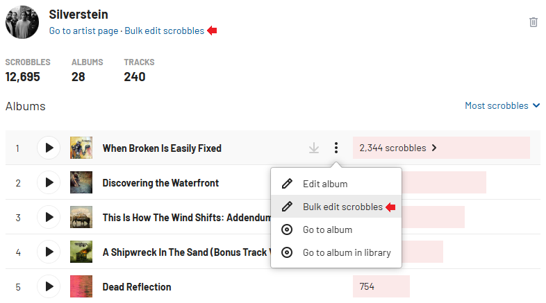

Advanced bulk edit features:
- Edit all scrobbles from one artist at once (to rename the artist).
- Edit all scrobbles from one or more albums at once.
- Edit all scrobbles from one track at once, even if the track is scrobbled under multiple albums.
- Works in combination with automatic edits (built-in feature from Last.fm Pro).

## Improved automatic edits page

Automatic edits is a built-in feature that comes with Last.fm Pro.
Automatic edits allows you to save track edits, and have them be applied automatically to future scrobbles.

Last.fm Advanced improves the [automatic edits page](https://www.last.fm/settings/subscription/automatic-edits) by adding the following features:

- Navigate track edits by selecting the artist name from a drop-down list.
- Show original track name, original artist name, original album name, and original album artist name.
- Emphasize the fields that have been edited with **bold text**.
- Load all track edits into a single page (optional).
  - Click on a column header to sort rows alphabetically by track/artist/album name.
- Widen the table if the track / artist / album / album artist name is very long, instead of truncating the text with "…".

With Last.fm Advanced, the automatic edits page looks like this:
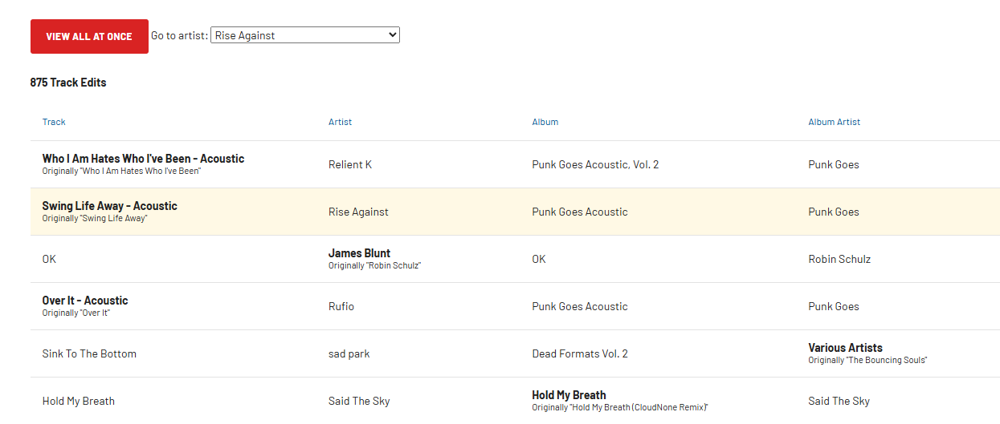

Compare the image above to the image below, which is what the automatic page looks like without Last.fm Advanced:
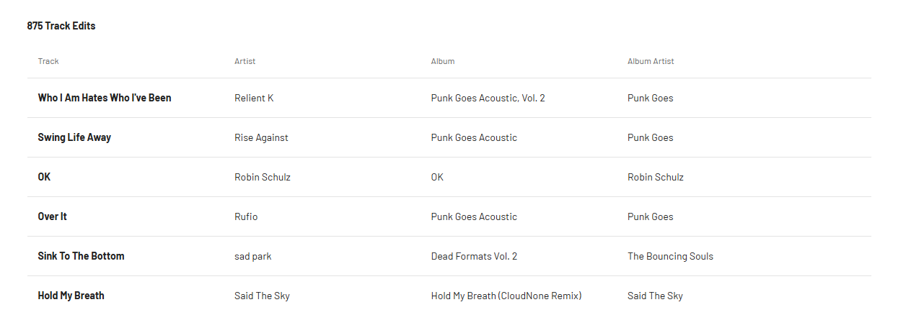

## View album names and album links in the scrobble overview

Last.fm Advanced improves the scrobble overview by adding album names and links.
This makes it easier to keep an eye on whether you are scrobbling with the correct album name.

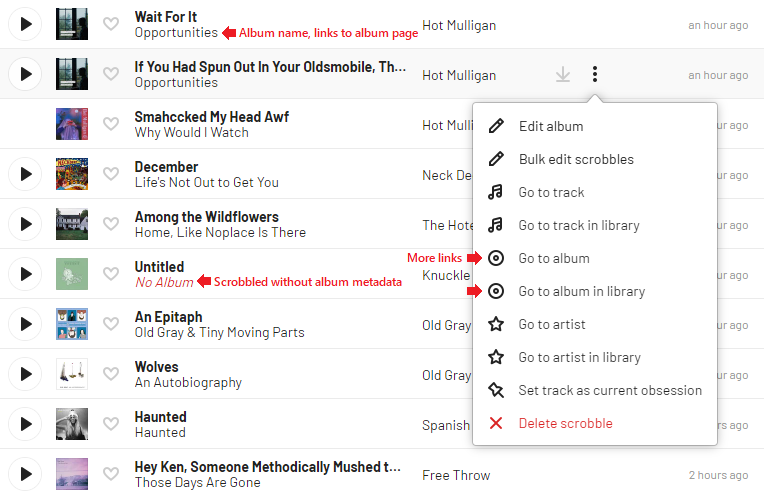

## Click timestamps to automatically set the date range filter

When viewing the scrobbles of a specific track in your library, the timestamps are now links that you can click.
Clicking a timestamp will set the date range filter to the day on which it was scrobbled.
This makes it easier to find which other tracks were scrobbled before and after.

Example:

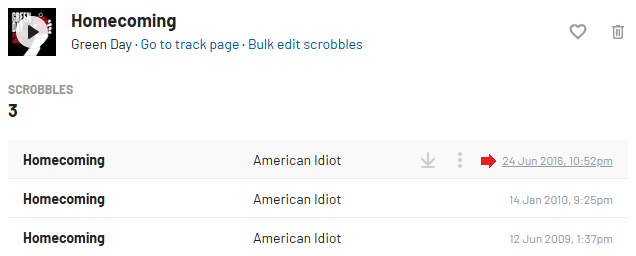

In the image above, clicking "24 Jun 2016, 10:52pm" will set the date range filter to "24 Jun 2016" and show all 26 scrobbles from that day, as shown in the image below.

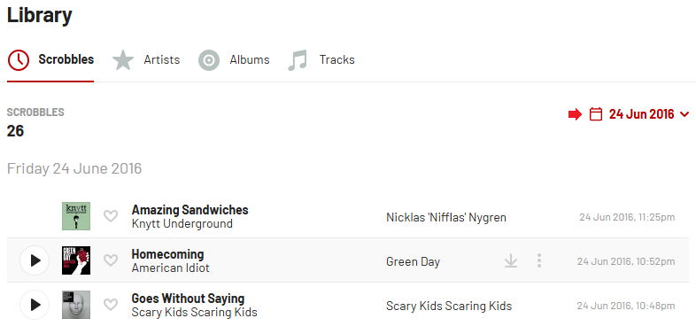

## Examples for advanced bulk edit

> [!NOTE]  
> The user interface has changed since these GIFs were recorded.

### Merging albums, fixing album names, and removing albums

Go to an artist in your library.
Open the ⋮ menu next to an album, and select "Edit scrobbles (Advanced)".
Wait for the dialog to load.
Edit the track, artist, album or album artist to your desire, then click "Save edit".

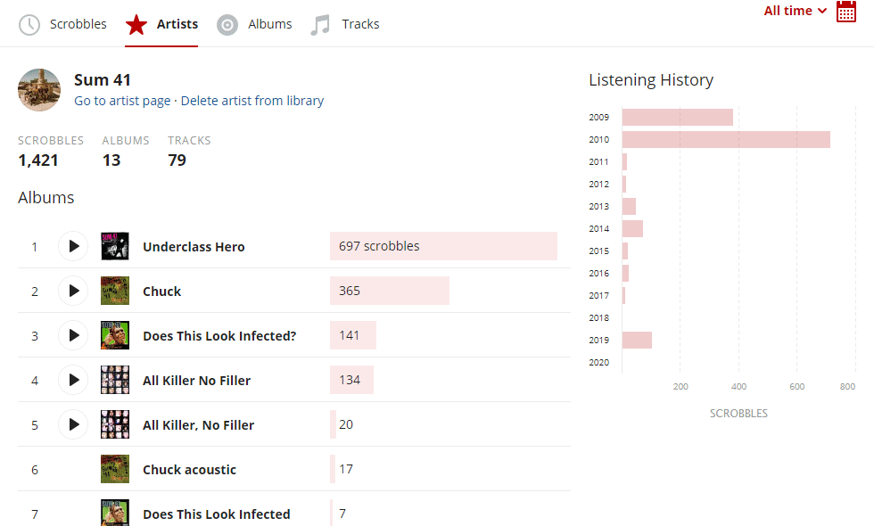

### Edit multiple albums at once.

Go to any artist in your library.
Last.fm Advanced will automatically detect when tracks have been scrobbled under multiple albums.
That may or may not be correct, so you'll be able to select which scrobbles get edited and which don't.

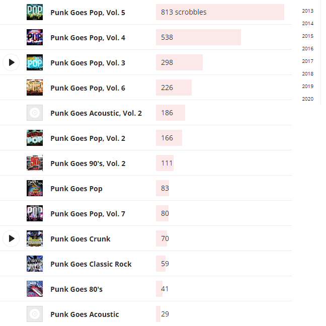

### Replacing an incorrect artist name with Last.fm's auto-corrected name

In this example, auto-corrections are enabled in Last.fm's website settings.
An artist named "Ben Prunty" was scrobbled 2,430 times.
However, in actuality, 274 of those scrobbles are attributed to "Ben Prunty Music".
This will become more apparent when you disable auto-corrections, which will make "Ben Prunty" and "Ben Prunty Music" show up as two separate artists.

In order to move away from auto-corrections, which cause many issues, you can use advanced bulk edit to merge artists, by simply renaming the incorrect spelling to the correct spelling.

This GIF also demonstrates that the album artist name is kept in sync when changing the artist name.
In this example, the tracks are scrobbled under three album artists: "Ben Prunty", "Ben Prunty Music" and "Lena Raine".
After renaming the artist field, the tracks are now scrobbled under only two album artists: "Ben Prunty" and "Lena Raine".
Ben Prunty's tracks on Lena Raine's album continue to be scrobbled with Lena Raine as the album artist, as you would expect.

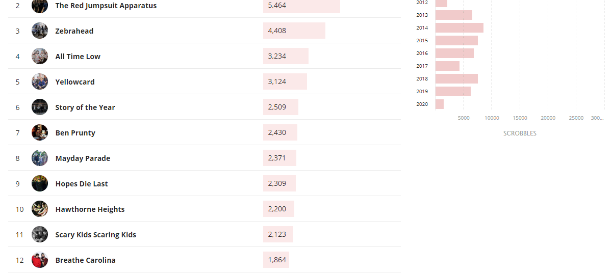

## Frequently asked questions

### How do I get in contact with you?

If you have found a bug, or want to propose a feature or improvement, feel free to open a [GitHub issue](https://github.com/RudeySH/lastfm-bulk-edit/issues).
For general support or discussion, use [GitHub discussions](https://github.com/RudeySH/lastfm-bulk-edit/discussions) or contact me on Discord, you'll find me in the [Last.fm Discord](https://discord.gg/6aTeg3u) (I'm @rudeysh).

### What happened to "Last.fm Bulk Edit"?

The project has been renamed to Last.fm Advanced.
When this userscript was first released, bulk edit was the only feature.
Now it provides more features that aren't necessarily related to scrobble editing.

### Why did my edit not save properly?

There could be many reasons for this.
Try refreshing the page after a minute.
Sometimes Last.fm servers are too busy, try again later.
Keep in mind that it is not possible to change just the upper or lower casing of names, [due to how these are stored in Last.fm's database](https://getsatisfaction.com/lastfm/topics/website-update-12-march-editing-scrobbles-subscriber-feature).

### Why do I need a Last.fm Pro subscription to use advanced bulk edit?

[Last.fm Pro](https://www.last.fm/pro) enables subscribers to edit scrobbles, one track[*](#f1) or album at a time.
Last.fm Advanced depends on this feature, and extends it by adding advanced bulk editing capabilities.

<strong id="f1">*</strong> Last.fm only lets you bulk edit an exact artist, track, album and album artist combination.
See the next paragraph for more information.

### How is Advanced bulk edit different from Last.fm's "Bulk edit" option?

When you edit a scrobble on Last.fm, you'll see this option:

When this option is enabled, all past scrobbles of this track will be edited.
However, if you scrobbled a track under multiple albums, Last.fm will only edit the scrobbles for one album at a time.

Advanced bulk edit lets you edit tracks that have been scrobbled under one or more albums, and lets you choose which album(s) the scrobbles are edited for.

### How is Advanced bulk edit different from Last.fm's "Edit album" feature?

Almost 5 years after the first version of this userscript was released, Last.fm added official support for album editing.
This built-in feature allows you to edit all scrobbles for an album at once, to rename the album or change the album artist.
It also allows you to enable automatic edits for albums.

Nowadays, if all you need is to rename an album, or edit the album artist, you should use Last.fm's built-in feature instead of Advanced bulk edit.
For more advanced use cases, such as merging multiple (3+) albums into one, or renaming artists, you should still use bulk edit, as Last.fm does not support it officially.

### What are userscripts?

Userscripts are programs that augment your browsing experience.
For example, they can add features or enhancements to existing websites.
Userscripts are not browser extensions.
Instead, they can be enabled by a userscript manager.
Userscript managers are browser extensions that install and run userscripts for you.

[Tampermonkey](https://tampermonkey.net/) and [Violentmonkey](https://violentmonkey.github.io/) are the most popular userscript managers.
Last.fm Advanced currently only supports Tampermonkey and Violentmonkey.

### Why is Greasemonkey not supported?

Last.fm Advanced uses the [Fetch API](https://developer.mozilla.org/en-US/docs/Web/API/Fetch_API) to post form data to edit scrobbles.
Greasemonkey has some issues with the Fetch API:
- https://github.com/greasemonkey/greasemonkey/issues/2647
- https://github.com/greasemonkey/greasemonkey/issues/3071
- https://github.com/greasemonkey/greasemonkey/issues/3072

### Why did you make this?

Because it is easy to scrobble with bad metadata, but hard to fix it.
Editing scrobbles one by one is a pain.
Music streaming services like Spotify do not allow you to clean up tags, so there is no way to prevent it from happening in the first place.

Redditors of [r/lastfm](https://www.reddit.com/r/lastfm) have expressed similar frustrations.

[u/willguitar100 posted](https://www.reddit.com/r/lastfm/comments/azks0z/the_most_painful_thing_ive_noticed_in_my_lastfm/):

> The most painful thing I've noticed in my last.fm yet.
Apparently I used the wrong apostrophe.

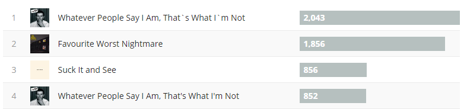

[u/Cyreniac posted](https://www.reddit.com/r/lastfm/comments/ahbr4w/are_memes_allowed_here/):

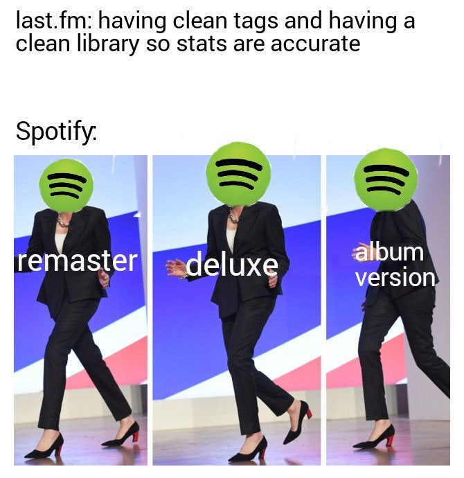

[u/Bluegorilla101 posted](https://www.reddit.com/r/lastfm/comments/8ver9b/the_struggles_of_using_spotify_to_scrobble/):

> The struggles of using Spotify to scrobble.

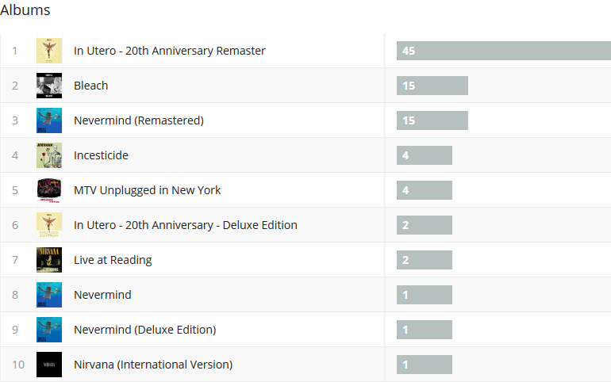

[u/tjdeignan posted](https://www.reddit.com/r/lastfm/comments/dagrtb/why/):

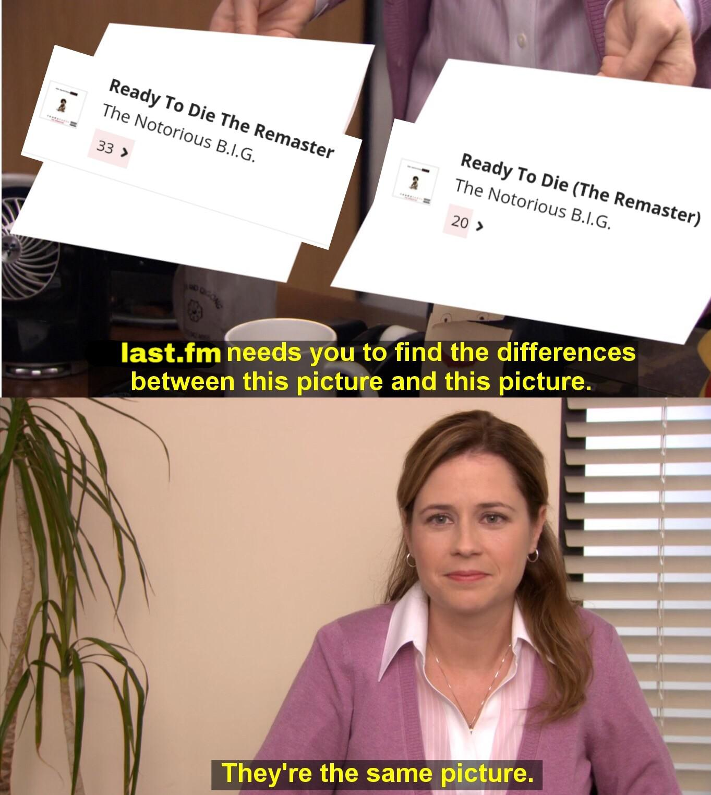

### Who are you?

I'm Rudey.
Check out [my Last.fm profile](https://www.last.fm/user/RudeySH).

### How do I support Last.fm Advanced?

Star this repository on GitHub and spread the word! Here's a PayPal donate link:

